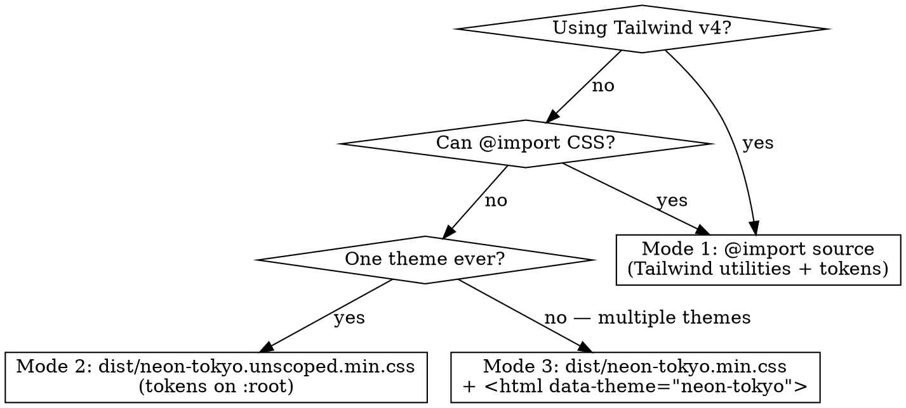

# Using Neon Tokyo

## Overview

Neon Tokyo is a dark, magenta-and-cyan, restraint-driven design system. Core principle: **glow is earned, not default**. A sparse palette becomes signature by repetition, not variety.

Full catalog lives in the theme's `README.md` and `Design System.html`. This skill is the fast path: how to consume the theme, which token/class to reach for, and which rules not to break.

## When to Use

- Integrating the theme into a new project (Vite+Tailwind, plain HTML, shadcn, CMS)
- Building a UI component and picking a color, font, radius, shadow, or glow
- Adding a new `.ntk-*` component or extending the ambient / glow / effects layers
- Reviewing a PR that touches visual styling in a Neon-Tokyo-themed app

**Don't use when:**
- Picking aesthetics for a non-Neon-Tokyo brand (that theme has its own skill)
- Editing the theme's own source files as an *author* (authoring rules differ from consumer rules — read the target file's header instead)

## Three consumption modes

The theme ships three entry points. Pick ONE per project — never mix.

| Mode | Invocation | Token names available | When |
|---|---|---|---|
| 1. Source | `@import "tailwindcss";` `@import "neon-tokyo/index.css";` | Both `--color-primary` (Tailwind `@theme`) AND `--primary` (sibling `:root`). Utilities auto-generate: `bg-primary`, `text-secondary`, `font-headline`, etc. | Tailwind v4 projects |
| 2. Unscoped dist | `<link href="dist/neon-tokyo.unscoped.min.css">` | Only `--primary`, `--foreground`, etc. **NO `--color-*` prefix** (Tailwind CLI strips it). Plus `.ntk-*` component classes. | Plain HTML, no bundler, single theme |
| 3. Scoped dist | `<link href="dist/neon-tokyo.min.css">` + `<html data-theme="neon-tokyo">` | Same as mode 2, but every rule wrapped under `[data-theme="neon-tokyo"]`. Lets you load multiple themes side-by-side. | Multi-theme sites, theme switchers |

## Token-naming gotcha (read this once, save yourself 20 min)

The theme's source declares each color token twice:
- `@theme { --color-primary: #ff2d78; ... }` — Tailwind v4 reads this to build utilities
- `:root { --primary: #ff2d78; ... }` — plain-CSS consumers read this

The **dist builds strip `--color-`** because Tailwind CLI folds `@theme` into `:root` without the prefix. So:

| Consumer writing… | Mode 1 (source) | Mode 2/3 (dist) |
|---|---|---|
| `var(--color-primary)` | ✓ works | ✗ undefined |
| `var(--primary)` | ✓ works | ✓ works |
| `bg-primary` (Tailwind utility) | ✓ works | ✗ no utilities in dist |

**Rule:** In raw CSS or inline `style=""`, always reach for the un-prefixed form (`var(--primary)`, `var(--foreground)`). In Tailwind class names, use the short form (`bg-primary`, `text-foreground`). Never write `var(--color-*)` in consumer code.

## Quick reference — tokens

### Color (raw CSS names; Tailwind utilities drop `--`)

| Token | Hex | Semantic role |
|---|---|---|
| `--primary` | `#ff2d78` | Hot magenta. Brand, the ONE primary action, focus ring, nav active marker |
| `--secondary` | `#00ffcc` | Cyan. Live sessions, online/success, positive progress |
| `--tertiary` | `#ffe04a` | Acid yellow. Waiting, warning, "needs input" |
| `--destructive` | `#ef4444` | Red. Errors, crashed state |
| `--background` | `#0a0a12` | Page base (very dark ink blue) |
| `--surface` | `#0f0f1a` | Card / panel |
| `--surface-container` | `#141422` | Raised surface, input fill |
| `--surface-container-high` | `#1e1e30` | Popovers, dropdowns, active row |
| `--outline-variant` | `#302840` | Dividers, quiet borders |
| `--foreground` | `#e2e8f0` | Body text (slate-200) |
| `--muted-foreground` | `#94a3b8` | Secondary text (slate-400) |

### Typography

| Token | Family | Use |
|---|---|---|
| `--font-headline` | Sora | H1–H3, logos, hero numbers |
| `--font-body` | Inter | Paragraphs, UI copy, buttons |
| `--font-label` | Space Grotesk | Uppercase labels, pills, metadata. Always pair with `uppercase` + `tracking-widest` (`0.15em`) + 10–11px |

### Glow — ONE per element, never stacked

| Class | Use |
|---|---|
| `.glow-text-primary` | Section accents |
| `.glow-text-primary-strong` | Hero only (logo / page title) |
| `.glow-border-primary` | Active panels |
| `.glow-dot-secondary` | Status dots |

### Atmospheric layers

| Class | Effect |
|---|---|
| (auto on `<body>`) | Subtle pink dot-grid |
| `.scanline` | CRT scanline overlay |
| `.edge-glow-right` | Inner magenta right edge (sidebars) |
| `.custom-scrollbar` | Thin neon scrollbar |
| `.ntk-ambient` wrapper + `.ntk-on-ambient` content | Drifting blurred color orbs. Intensity via `data-intensity="soft\|default\|bold"`. Respects `prefers-reduced-motion` |

## Quick reference — component classes

| Need | Class(es) |
|---|---|
| Button | `.ntk-btn` + `.ntk-btn-{primary,secondary,ghost,outline}` (NB: no `ntk-btn-tertiary`) |
| Badge | `.ntk-badge` + `.ntk-badge-{primary,warning,destructive}` · pair with `<i class="ntk-dot">` for a status dot |
| Card | `.ntk-card` · elevate with `.ntk-card-active` |
| Input | `<input class="ntk-input">` wrapped by `<label class="ntk-label">` |

## Design recipes

**Status pill** — live/waiting/crashed: `bg-{secondary,tertiary,destructive}/10` + `text-{secondary,tertiary,destructive}` + `border-{same}/20` + 10px `font-label uppercase tracking-wider` + pulsing dot via `.ntk-dot` or `bg-{hue} animate-pulse`.

**Nav item (active)**: `text-primary bg-primary/10 border-r-2 border-primary glow-nav-active` + icon + `font-headline uppercase tracking-wider`.

**Progress bar**: `h-1.5 bg-surface-container rounded-full` container, inner fill `bg-gradient-to-r from-secondary to-primary`.

**Hero headline** (one per page): `font-headline text-primary glow-text-primary-strong`.

**Signature label** (used everywhere): `text-[10px] font-label font-bold uppercase tracking-widest text-secondary`.

## Aesthetic rules — hard

Break any of these and the system falls apart:

1. **Magenta is scarce.** One `--primary`-colored element per frame — brand mark, the single most important action, or focus ring. Never two magenta CTAs side by side.
2. **Glow is earned.** Text OR border, never both on one element. Reserve `-strong` variants for the logo + page title only.
3. **Color carries meaning.** `secondary` = live/healthy. `tertiary` = waiting/warning. `destructive` = error. Never decorative.
4. **Dark breathes.** Panels are cutouts in darkness, not stacked boxes. Only elevate to `--surface-container-high` for an *active* element.
5. **Labels: uppercase + tracked.** `font-label` + `uppercase` + `tracking-widest` + 10–11px. This is the system's connective tissue; it appears on every screen.
6. **No raw hex in components.** If a color isn't in the token table, add it to `styles/colors.css` first, then reference the alias.

## Extending the theme

| Adding… | Goes in |
|---|---|
| New brand color | `styles/colors.css`, plus a semantic alias in `styles/semantics.css` if it has a role |
| New font family | `styles/fonts.css` (the `@import`) + `styles/typography.css` (the token) |
| New radius | `styles/radii.css` |
| New glow flavor | `styles/glow.css` |
| New `.ntk-*` component | New file in `styles/components/` + `@import` line in `index.css` |

Keep component-level CSS out of the token files. Keep tokens out of `base.css`. That separation is what keeps the theme portable.

After any source change that affects `@theme` or `:root`, rebuild the dist (`npm run build` in the theme dir) if consumers depend on the prebuilt artifact.

## Common mistakes

| Mistake | Why it breaks | Fix |
|---|---|---|
| `var(--color-primary)` in consumer CSS | Dist strips `--color-` prefix → undefined at runtime on mode 2/3 | Use `var(--primary)` |
| Stacking `glow-text-*` and `glow-border-*` on one element | Visual noise, breaks hierarchy | Pick one |
| Large surface filled with `--primary` or `--secondary` | Accents become fills, hierarchy collapses | Use `--surface` / `--surface-container` for fills; accent for stroke / text / small marks only |
| Hardcoded `#ff2d78` in a component | Can't reskin, can't swap themes at runtime | Reference `--primary` |
| Uppercase label without `font-label` | Wrong metrics, tracking doesn't read right | Always pair `uppercase` + `font-label` + `tracking-widest` |
| Adding `.ntk-btn-tertiary` or `.ntk-card-raised` because "it should exist" | Neither is defined; shim classes drift the system | Check `styles/components/*.css` first; extend only if a new role truly emerges |
| Body copy in pure `#fff` | Too harsh on the dark base | Use `var(--foreground)` (slate-200) |
| Mixing mode 1 (source) with mode 2 (dist) | Duplicate declarations, cascade surprises | Pick exactly one consumption mode per project |

## Red flags — STOP and reconsider

- About to type `color: #ff2d78` or any other theme hex → use the token
- Element has both `glow-text-*` AND `glow-border-*` → drop one
- Two magenta CTAs in the same frame → one must become `ghost` / `outline`
- Designing a new "muted purple" or "warm rust" shade for a new role → you're drifting toward a different theme; step back
- About to invoke a class with a prefix that isn't `.ntk-` / `.glow-` / `.scanline` / `.edge-glow-` / `.custom-scrollbar` / `.ntk-ambient` → it probably doesn't exist in this theme
